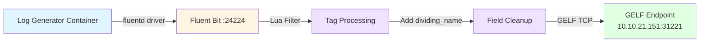

# log-testing-with-fluent-bit
```
 ___      _______  _______  _______  ___   __    _  _______      _     _ /     _______  ___      __   __  _______  __    _  _______         _______  ___   _______ 
|   |    |       ||       ||       ||   | |  |  | ||       |    | | _ | |     |       ||   |    |  | |  ||       ||  |  | ||       |       |  _    ||   | |       |
|   |    |   _   ||    ___||    ___||   | |   |_| ||    ___|    | || || |     |    ___||   |    |  | |  ||    ___||   |_| ||_     _| ____  | |_|   ||   | |_     _|
|   |    |  | |  ||   | __ |   | __ |   | |       ||   | __     |       |     |   |___ |   |    |  |_|  ||   |___ |       |  |   |  |____| |       ||   |   |   |  
|   |___ |  |_|  ||   ||  ||   ||  ||   | |  _    ||   ||  |    |       |     |    ___||   |___ |       ||    ___||  _    |  |   |         |  _   | |   |   |   |  
|       ||       ||   |_| ||   |_| ||   | | | |   ||   |_| |    |   _   |     |   |    |       ||       ||   |___ | | |   |  |   |         | |_|   ||   |   |   |  
|_______||_______||_______||_______||___| |_|  |__||_______|    |__| |__|     |___|    |_______||_______||_______||_|  |__|  |___|         |_______||___|   |___|  
```

A Docker-based log generation and forwarding system for testing Fluent Bit configurations with GELF (Graylog Extended Log Format) output.

## Table of Contents

- [Overview](#overview)
- [Architecture](#architecture)
- [Features](#features)
- [Prerequisites](#prerequisites)
- [Project Structure](#project-structure)
- [Configuration](#configuration)
  - [Docker Compose](#docker-compose)
  - [Fluent Bit Configuration](#fluent-bit-configuration)
  - [Lua Script](#lua-script)
- [Getting Started](#getting-started)
- [Log Format Examples](#log-format-examples)
- [Customization](#customization)
- [Troubleshooting](#troubleshooting)
- [Acknowledgment](#acknowledgment)

## Overview

This project provides a complete testing environment for Fluent Bit's GELF output functionality. It consists of two main components:

1. **Log Generator**: A bash-based container that generates various log levels (INFO, DEBUG, WARN, ERROR)
2. **Fluent Bit**: Collects logs via Docker's fluentd logging driver and forwards them to a GELF endpoint

## Architecture



## Features

- **Automatic log generation** with multiple severity levels (INFO, DEBUG, WARN, ERROR)
- **Docker fluentd logging driver** integration
- **Custom Lua filtering** for tag extraction and field manipulation
- **GELF TCP output** for compatibility with Graylog, Logstash, and other GELF receivers
- **Container name tagging** with custom identifier format
- **Line ending fixes** for cross-platform compatibility (CRLF → LF)

## Prerequisites

- Docker Engine 20.10+
- Docker Compose 1.29+
- Network access to your GELF endpoint (default: `10.10.21.151:31221`)

## Project Structure

```
.
├── docker-compose.yml      # Service orchestration
├── Dockerfile             # Log generator image
├── fluent-bit.conf        # Fluent Bit configuration
├── functions.lua          # Lua filter for log processing
└── log-generator.sh       # Bash script for log generation
```

## Configuration

### Docker Compose

The `docker-compose.yml` defines two services:

- **fluent-bit**: Listens on port 24224 (TCP/UDP) for incoming logs
- **log-generator**: Generates logs and sends them via fluentd driver

Both services run on a shared `logging` bridge network.

### Fluent Bit Configuration

Key configuration in `fluent-bit.conf`:

| Section | Purpose |
|---------|---------|
| **INPUT** | Forward input listening on `0.0.0.0:24224` |
| **FILTER** | Lua script (`functions.lua`) processes tags and records |
| **OUTPUT** | GELF TCP output to `10.10.21.151:31221` |

**Important Settings:**
- `Gelf_Short_Message_Key`: Set to `log` (matches Docker log field)
- `Mode`: `tcp` for reliable delivery

### Lua Script

The `functions.lua` script performs three operations:

1. **Tag Parsing**: Extracts container name from `docker.container_name` format
2. **Custom Field Addition**: Creates `dividing_name` field with format `ubuntu_prod:container_name`
3. **Field Cleanup**: Removes `container_id` to reduce GELF payload size

## Getting Started

1. **Clone or create the project structure** with all five files

2. **Update GELF endpoint** in `fluent-bit.conf`:
   ```properties
   [OUTPUT]
       Host    YOUR_GELF_HOST
       Port    YOUR_GELF_PORT
   ```

3. **Customize server identifier** in `functions.lua`:
   ```lua
   record["dividing_name"] = "YOUR_SERVER_NAME:" .. container_name
   ```

4. **Start the services**:
   ```bash
   docker-compose up --build
   ```

5. **Verify logs are flowing**:
   ```bash
   docker-compose logs -f fluent-bit
   ```

6. **Check your GELF receiver** (Graylog, etc.) for incoming messages

## Log Format Examples

The log generator produces five types of messages in rotation:

```
[INFO] 2024-12-07 10:15:30 - Processing request #1
[DEBUG] 2024-12-07 10:15:32 - Debug message 2 - Memory usage: 47%
[WARN] 2024-12-07 10:15:34 - Warning: High latency detected - 1823ms
[ERROR] 2024-12-07 10:15:36 - Error processing item 4 - Retrying...
[INFO] 2024-12-07 10:15:38 - Successfully completed operation 5
```

Each log entry includes:
- Severity level
- Timestamp
- Descriptive message
- Counter/random data

## Customization

### Change Log Generation Frequency

Edit `log-generator.sh`:
```bash
sleep 2  # Change to desired interval in seconds
```

### Add More Log Levels

Extend the case statement in `log-generator.sh`:
```bash
case $((counter % 6)) in
    5)
        echo "[CRITICAL] $(date '+%Y-%m-%d %H:%M:%S') - Critical error!"
        ;;
esac
```

### Modify GELF Fields

In `functions.lua`, add custom fields:
```lua
record["environment"] = "production"
record["application"] = "my-app"
record["version"] = "1.0.0"
```

### Use UDP Instead of TCP

Change in `fluent-bit.conf`:
```properties
[OUTPUT]
    Mode    udp
```

## Troubleshooting

### Logs Not Appearing in GELF Receiver

1. **Check Fluent Bit logs**:
   ```bash
   docker-compose logs fluent-bit
   ```

2. **Verify network connectivity**:
   ```bash
   docker-compose exec fluent-bit ping 10.10.21.151
   ```

3. **Test GELF endpoint**:
   ```bash
   nc -zv 10.10.21.151 31221
   ```

### "Exec format error" or Script Fails

The Dockerfile includes `dos2unix` to fix line endings. If issues persist:
```bash
dos2unix log-generator.sh
git add --renormalize .
```

### Container Exits Immediately

Check log generator output:
```bash
docker-compose logs log-generator
```

### Fluent Bit Connection Refused

Ensure the fluentd address matches your Docker network:
```yaml
fluentd-address: "fluent-bit:24224"  # Use service name, not localhost
```

## Acknowledgment

### Contributors

* APA 🖖🏻

### Links
- [go2docs.graylog.org](go2docs.graylog.org)


```
  aaaaaaaaaaaaa  ppppp   ppppppppp     aaaaaaaaaaaaa   
  a::::::::::::a p::::ppp:::::::::p    a::::::::::::a  
  aaaaaaaaa:::::ap:::::::::::::::::p   aaaaaaaaa:::::a 
           a::::app::::::ppppp::::::p           a::::a 
    aaaaaaa:::::a p:::::p     p:::::p    aaaaaaa:::::a 
  aa::::::::::::a p:::::p     p:::::p  aa::::::::::::a 
 a::::aaaa::::::a p:::::p     p:::::p a::::aaaa::::::a 
a::::a    a:::::a p:::::p    p::::::pa::::a    a:::::a 
a::::a    a:::::a p:::::ppppp:::::::pa::::a    a:::::a 
a:::::aaaa::::::a p::::::::::::::::p a:::::aaaa::::::a 
 a::::::::::aa:::ap::::::::::::::pp   a::::::::::aa:::a
  aaaaaaaaaa  aaaap::::::pppppppp      aaaaaaaaaa  aaaa
                  p:::::p                              
                  p:::::p                              
                 p:::::::p                             
                 p:::::::p                             
                 p:::::::p                             
                 ppppppppp                                                        
```